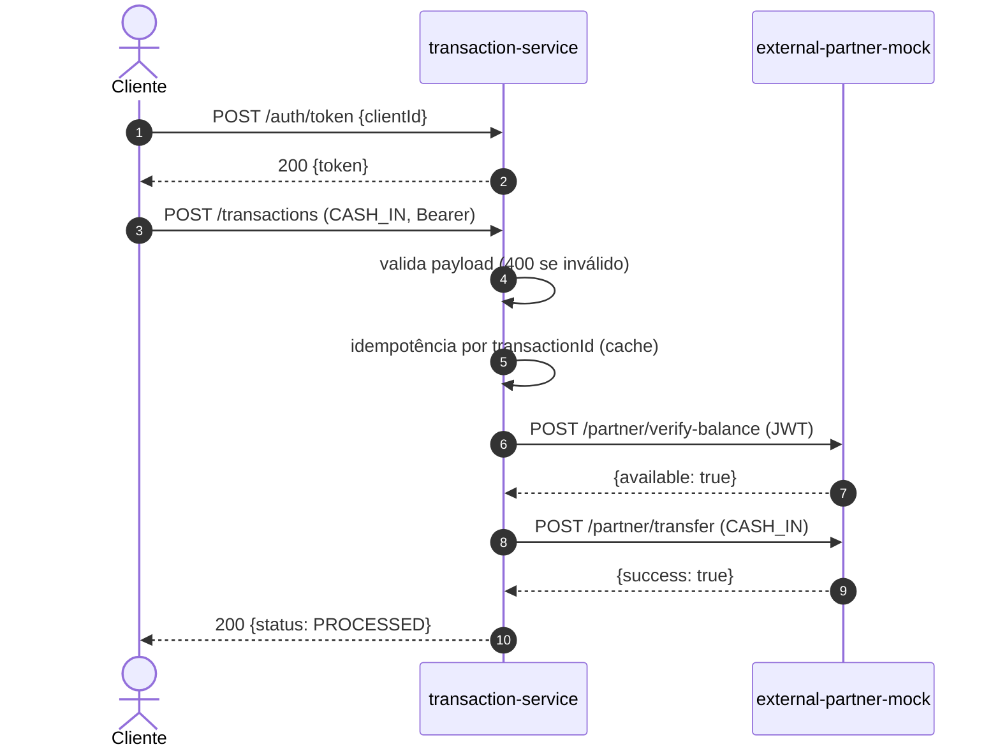
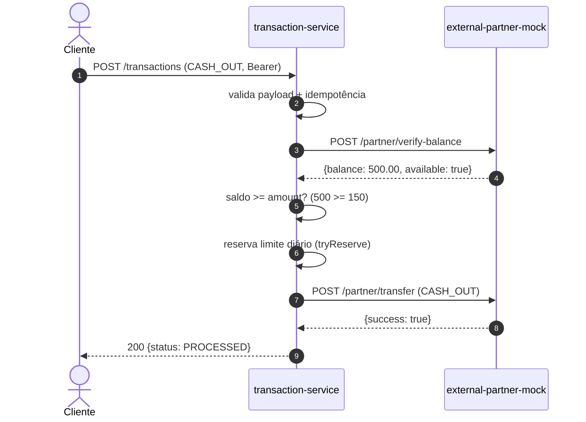
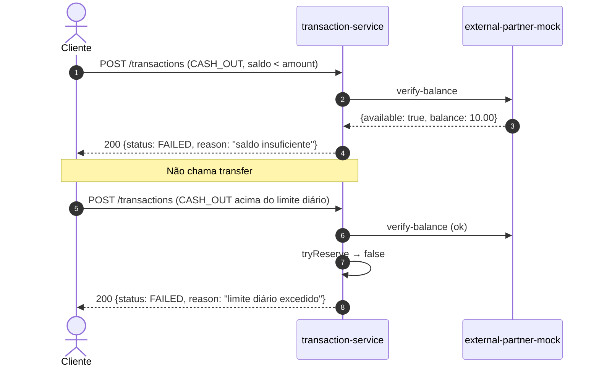
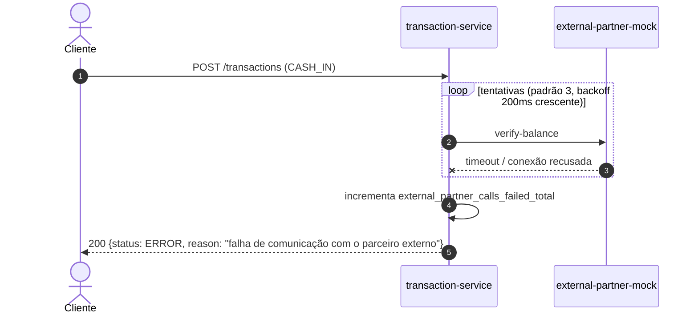
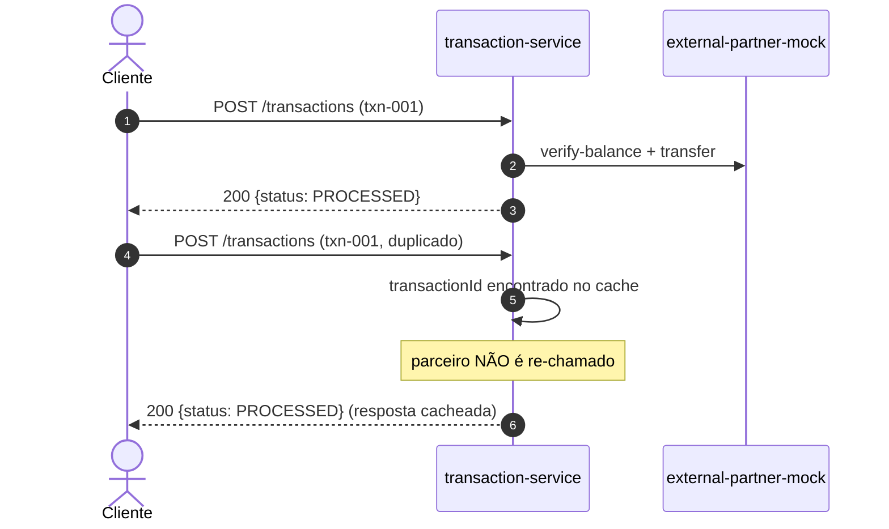
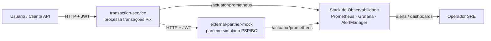
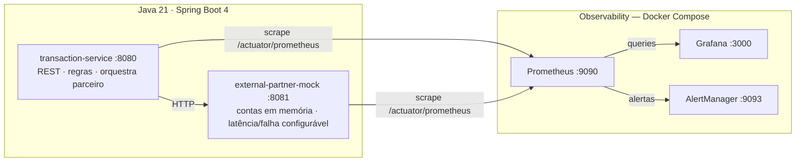
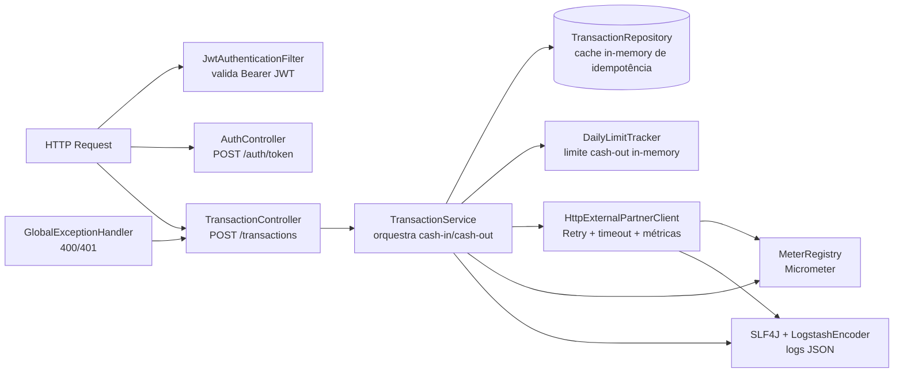
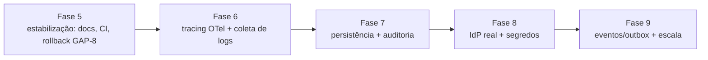

# System Design — Pix Transaction Observability

> Documento de levantamento de requisitos e design de sistema do projeto. Descreve **o que** o sistema precisa fazer (requisitos funcionais e não-funcionais), **as regras de negócio**, **a arquitetura-alvo do MVP** e **as decisões tomadas**, além de mapear o que já está implementado e os gaps para evolução.
>
> Documentos relacionados: [Arquitetura](./architecture.md) · [API](./API.md) · [Observabilidade](./OBSERVABILITY.md) · [Desenvolvimento](./DEVELOPMENT.md)

---

## 1. Visão Geral

### 1.1 Contexto de Negócio

O sistema simula um **serviço transacional Pix** que processa operações de **cash-in** (crédito) e **cash-out** (débito). Opera em um ambiente **regulamentado**, onde:

- Confiabilidade é requisito crítico (operações financeiras);
- Incidentes precisam ser **detectados e resolvidos rapidamente**;
- Há dependência de **parceiros externos** (PSP / Banco Central) fora do controle do serviço;
- Toda transação precisa ser **rastreável** para auditoria e suporte.

A proposta do projeto é construir o serviço com **observabilidade desde o Dia Um**: logs, métricas e saúde são requisitos de primeira classe, não uma reflexão tardia.

### 1.2 Objetivos

| # | Objetivo | Métrica de sucesso |
| --- | --- | --- |
| O-1 | Observabilidade nativa em todos os serviços | Logs JSON, métricas Prometheus e health checks disponíveis em cada serviço |
| O-2 | Resiliência à latência e erros de parceiros externos | Transação sobrevive a falhas transitórias via retry; falha permanente classificada como `ERROR` |
| O-3 | Simulação realista de produção | Mock do parceiro com latência e taxa de falha configuráveis |
| O-4 | Ambiente autônomo de demonstração | Stack completa sobe com Docker Compose e dashboard pronto |

### 1.3 Escopo

**No escopo (MVP):**

- Processamento síncrono de transações Pix cash-in/cash-out via REST;
- Validação de payload, autenticação JWT e regras de negócio;
- Idempotência por `transactionId` e limite diário de cash-out;
- Integração com parceiro externo (consulta de saldo e transferência) com retry/timeout;
- Logs estruturados, métricas de negócio/integração e health checks;
- Stack de observabilidade (Prometheus, Grafana, AlertManager) e simulação de falha do parceiro.

**Fora do escopo (MVP):**

- Persistência real (idempotência, limite diário e saldos são em memória);
- Tracing distribuído (OpenTelemetry) — gap em aberto (Fase 6);
- Autenticação real com provedor de identidade (OAuth2/OIDC);
- Fila/mensageria e consistência eventual entre serviços;
- CI/CD, containerização dos serviços Java e infraestrutura de produção;
- Liquidação/compensação real do Pix (o parceiro é um simulador).

### 1.4 Atores e Stakeholders

| Ator | Papel |
| --- | --- |
| Cliente / Consumidor | Aplica transações Pix (via API, autenticado com JWT) |
| Parceiro Externo (PSP / Banco Central) | Fonte de verdade de saldo; executa verificação e transferência (simulado pelo `external-partner-mock`) |
| Operador de SRE / Suporte | Consome logs, métricas, alertas e dashboards para operar e diagnosticar o sistema |
| Desenvolvedor | Evolui o sistema seguindo as convenções documentadas |

---

## 2. Requisitos Funcionais (RF)

Legenda de status de implementação: ✅ implementado · 🟡 parcialmente implementado · ⬜ não implementado (gap).

### 2.1 Processamento de Transações

| ID | Requisito | Prioridade | Status |
| --- | --- | --- | --- |
| **RF-01** | O sistema deve processar uma transação **cash-in** (crédito à conta) a partir de `POST /transactions`, validando a conta no parceiro e executando a transferência. | Alta | ✅ |
| **RF-02** | O sistema deve processar uma transação **cash-out** (débito da conta), validando saldo e **limite diário** antes de executar a transferência. | Alta | ✅ |
| **RF-03** | O sistema deve **validar o payload** da transação: `transactionId` e `accountId` não vazios, `amount` maior que zero e `type` igual a `CASH_IN` ou `CASH_OUT`; payload inválido deve retornar **HTTP 400** com a lista de erros. | Alta | ✅ |
| **RF-04** | O sistema deve garantir **idempotência por `transactionId`**: reenvio de uma transação já processada deve retornar a resposta anterior, **sem re-chamar** o parceiro externo. | Alta | ✅ |
| **RF-05** | O sistema deve aplicar um **limite diário de cash-out por conta** (configurável); valores que excederem o limite devem ser rejeitados com `FAILED`. | Alta | ✅ |

### 2.2 Integração com o Parceiro Externo

| ID | Requisito | Prioridade | Status |
| --- | --- | --- | --- |
| **RF-06** | O sistema deve **consultar saldo/disponibilidade** da conta no parceiro (`verify-balance`) antes de transferir. | Alta | ✅ |
| **RF-07** | O sistema deve **executar a transferência** no parceiro (`transfer`) aplicando o delta ao saldo. | Alta | ✅ |
| **RF-08** | Em **falha de comunicação** com o parceiro (timeout/serviço fora), o sistema deve **tentar novamente** com backoff antes de declarar falha. | Alta | ✅ |
| **RF-09** | O sistema deve classificar o resultado final: **`PROCESSED`** (sucesso), **`FAILED`** (falha de negócio) ou **`ERROR`** (falha técnica — comunicação esgotada). | Alta | ✅ |

### 2.3 Segurança

| ID | Requisito | Prioridade | Status |
| --- | --- | --- | --- |
| **RF-10** | Endpoints de transação (`/transactions/**`) e de parceiro (`/partner/**`) devem exigir **JWT Bearer válido**; ausência/token inválido deve retornar **HTTP 401**. | Alta | ✅ |
| **RF-11** | O sistema deve oferecer um **endpoint de emissão de token de teste** (`POST /auth/token`) para desenvolvimento, emitindo JWT para um `clientId` informado. | Média | ✅ |

### 2.4 Observabilidade

| ID | Requisito | Prioridade | Status |
| --- | --- | --- | --- |
| **RF-12** | O sistema deve emitir **logs estruturados (JSON)** cobrindo cada etapa crítica da transação (início, idempotência, falha de negócio, erro de comunicação, resultado e duração). | Alta | ✅ |
| **RF-13** | O sistema deve expor **métricas de negócio e integração** (total de transações por `type`/`status`, latência de processamento, falhas e latência de chamadas ao parceiro). | Alta | ✅ |
| **RF-14** | O sistema deve expor **health checks** de liveness e readiness, incluindo a **conectividade com o parceiro** no readiness (`partnerConnectivity`). | Alta | ✅ |
| **RF-15** | O mock do parceiro deve **simular latência artificial e taxa de falha** configuráveis, permitindo exercitar os retries do `transaction-service`. | Alta | ✅ |
| **RF-16** | Os serviços devem **expor `/actuator/prometheus`** para coleta pelo Prometheus. | Alta | ✅ |

---

## 3. Requisitos Não Funcionais (RNF)

| ID | Requisito | Descrição | Status |
| --- | --- | --- | --- |
| **RNF-01** | Observabilidade (3 pilares) | Logs estruturados, métricas e health checks nativos em todos os serviços, sem configuração adicional. | ✅ |
| **RNF-02** | Resiliência | Comportamento resiliente a falhas transitórias do parceiro: timeouts de conexão (1s) e leitura (2s), retry com backoff e idempotência. | ✅ |
| **RNF-03** | Segurança | Autenticação JWT em endpoints de negócio; segredo não embutido em código (somente valor *default* de demonstração, sobrescrevível por env). | 🟡 (auth demo — sem IdP real) |
| **RNF-04** | Performance | Latência de leitura ao parceiro limitada a 2s; p95 de processamento e de chamada ao parceiro monitorados (percentile histograms). | ✅ |
| **RNF-05** | Disponibilidade | Probes de liveness/readiness configurados; indisponibilidade detectada e alertada via Prometheus/AlertManager. | ✅ |
| **RNF-06** | Manutenibilidade | Estrutura em camadas por serviço, convenções documentadas, Java 21 + Spring Boot 4. | ✅ |
| **RNF-07** | Testabilidade | Testes unitários e de integração por serviço cobrindo fluxos principais e falhas. | ✅ |
| **RNF-08** | Portabilidade | Execução local com Maven Wrapper (sem instalar Maven); stack de observabilidade via Docker Compose; configuração por variáveis de ambiente. | ✅ |
| **RNF-09** | Rastreabilidade | IDs de transação presentes nos logs para correlação manual. Tracing distribuído (correlação automática entre serviços) **não** está implementado. | 🟡 |
| **RNF-10** | Escalabilidade | Serviços desenhados `stateless`; porém o estado em memória (idempotência, limite diário, saldos) impede escala horizontal com consistência. | 🟡 |

---

## 4. Regras de Negócio (RN)

| ID | Regra | Comportamento |
| --- | --- | --- |
| **RN-01** | `amount` deve ser maior que zero | Violação → HTTP 400 (validação de payload) |
| **RN-02** | `type` deve ser `CASH_IN` ou `CASH_OUT` | Violação → HTTP 400 (validação de payload) |
| **RN-03** | Conta não disponível no parceiro | `FAILED` — motivo `"conta não disponível"` (cash-in) |
| **RN-04** | Saldo insuficiente para cash-out | `FAILED` — motivo `"saldo insuficiente"` |
| **RN-05** | Limite diário de cash-out excedido | `FAILED` — motivo `"limite diário excedido"` |
| **RN-06** | Parceiro recusa a transferência | `FAILED` — motivo `"falha na transferência"` |
| **RN-07** | Comunicação com o parceiro esgotada após retries | `ERROR` — motivo `"falha de comunicação com o parceiro externo"` |
| **RN-08** | Reenvio de `transactionId` já processado | Retorna a resposta cacheada; parceiro **não** é re-chamado |
| **RN-09** | O `transaction-service` **não** é a fonte de verdade do saldo | O parceiro detém e atualiza os saldos; o serviço apenas orquestra |

> **Comportamento observado (edge case):** no cash-out, se a transferência falhar **após** a reserva do limite diário (`dailyLimitTracker.tryReserve`), a reserva **não é revertida** — falhas de cash-out contam contra o limite diário. É um comportamento documentado, mas candidato a correção (ver [GAP-8](#gaps-e-roadmap) e [Risco R-1](#riscos-e-mitigações)).

---

## 5. Casos de Uso e Fluxos

### 5.1 UC-01 · Cash-in com sucesso



### 5.2 UC-02 · Cash-out com sucesso



### 5.3 UC-03 · Falhas de negócio (cash-out)



### 5.4 UC-04 · Falha técnica do parceiro (retry esgotado)



### 5.5 UC-05 · Idempotência



---

## 6. Arquitetura

### 6.1 Visão C4 — Contexto



### 6.2 Visão C4 — Containers



### 6.3 Visão C4 — Componentes (`transaction-service`)



### 6.4 Fluxo de Dados — `POST /transactions`

1. Requisição autenticada chega ao `TransactionController` (`TransactionController.java`).
2. Payload é validado com `jakarta.validation`; inválido → `GlobalExceptionHandler` retorna **400** com lista de erros.
3. `TransactionService.process()` verifica idempotência no `TransactionRepository` (cache em memória); se já processado, retorna resposta cacheada.
4. Conforme o `type`, executa `processCashIn` ou `processCashOut`, sempre através do `HttpExternalPartnerClient` (RestClient), que:
   - gera um novo JWT a cada chamada (`clientId = "transaction-service"`);
   - aplica timeouts de conexão/leitura configuráveis;
   - repete a chamada com **backoff crescente** (`backoff-ms × attempt`) até `max-attempts`;
   - mede a latência por operação/resultado e incrementa `external_partner_calls_failed_total` ao esgotar.
5. Resultado (`PROCESSED`/`FAILED`/`ERROR`) é salvo no cache, métricas `transaction_total` e `transaction_processing_duration_seconds` são emitidas, e o log estruturado de conclusão é gravado.
6. Resposta **sempre HTTP 200** com o status de negócio no corpo, exceto 400 (validação) e 401 (autenticação).

### 6.5 Modelo de Estado

| Estado | Onde vive | Fonte de verdade | Observação |
| --- | --- | --- | --- |
| Resultado de transação (idempotência) | `TransactionRepository` — `ConcurrentHashMap` in-memory | `transaction-service` | Perdido em restart; impede multi-instância |
| Total cash-out diário por conta | `DailyLimitTracker` — `ConcurrentHashMap` in-memory (`conta:data`) | `transaction-service` | Reset natural à meia-noite; perdido em restart |
| Saldo das contas | `PartnerService` in-memory (`acc-123`=1000.00, `acc-789`=500.00) | `external-partner-mock` | O parceiro (simulado) é a fonte de verdade do saldo |
| Pedidos de transação → status | Não persistido — apenas logs e métricas | — | Sem trilha de auditoria persistente (gap) |

---

## 7. Visão de Observabilidade

### 7.1 Os três pilares

| Pilar | Implementação |
| --- | --- |
| **Logs** | `logstash-logback-encoder` + `LogstashEncoder` no Console; campo customizado `service`; mensagens com `transactionId`, status e duração em cada etapa crítica. Ex.: `Transaction final-2 processed as PROCESSED in 1ms`. |
| **Métricas** | Micrometer (`micrometer-registry-prometheus`), expostas em `/actuator/prometheus`. Métricas próprias: `transaction_total`, `transaction_processing_duration_seconds`, `external_partner_calls_failed_total`, `external_partner_call_duration_seconds` (histograms com `publishPercentileHistogram`, permitindo `histogram_quantile` no Prometheus). |
| **Saúde** | `/actuator/health` com grupos `liveness` e `readiness`; readiness do `transaction-service` inclui o indicador `partnerConnectivity` (chama `/actuator/health` do parceiro, sem auth/retry). |

### 7.2 Fluxo de telemetria

```mermaid
flowchart LR
    TS[transaction-service] -->|métricas + métricas de negócio| PR[Prometheus]
    PM[external-partner-mock] -->|métricas HTTP + health| PR
    TS -->|logs JSON stdout| LO[(Coleta de logs — gap)]
    PR -->|regras rules.yml| AM[AlertManager]
    PR --> GR[Grafana dashboard pix-overview]
    AM -->|sem canal configurado (demo)| CHAN[X]
```

### 7.3 Alertas configurados (`prometheus/rules.yml`)

| Alerta | Condição | Severidade |
| --- | --- | --- |
| `HighTransactionErrorRate` | Taxa de `ERROR` > 5% em 5m (sustentado) | warning |
| `PartnerCallFailuresHigh` | > 5 falhas de chamada ao parceiro em 10m | warning |
| `TransactionServiceDown` | `up{job="transaction-service"} == 0` por 1m | critical |
| `ExternalPartnerMockDown` | `up{job="external-partner-mock"} == 0` por 1m | critical |

### 7.4 SLIs e SLOs propostos

| SLI | SLO sugerido | Instrumentado por |
| --- | --- | --- |
| Disponibilidade do serviço (`up`) | 99.9% | `up` + alerta `*Down` |
| Taxa de erro de transações (`status=ERROR`) | < 5% | `transaction_total` + alerta |
| Latência p95 de processamento | < 1s | `transaction_processing_duration_seconds` |
| Latência p95 de chamada ao parceiro | < leitura timeout (2s) | `external_partner_call_duration_seconds` |

> Os SLIs estão disponíveis; **os SLOs como acordos formais não estão definidos** no projeto (gap de governança — ver [GAP-7](#gaps-e-roadmap)).

---

## 8. Decisões de Arquitetura (ADRs)

### ADR-001 — Observability-first desde o Dia Um

- **Contexto:** ambiente regulamentado exige detecção rápida de incidentes; logs, métricas e saúde foram tratados como requisito, não como pós-processamento.
- **Alternativas consideradas:** instrumentar apenas no fim do projeto.
- **Decisão:** logs JSON estruturados, Micrometer + Prometheus e health checks implementados em todos os serviços desde o início.
- **Consequências:** custo baixo por serviço (3 dependências), valor alto de diagnóstico; documentado em [OBSERVABILITY.md](./OBSERVABILITY.md).

### ADR-002 — Estado em memória no MVP (sem persistência)

- **Contexto:** MVP foca em demonstrar o comportamento transacional e a observabilidade, não a durabilidade.
- **Alternativas:** Postgres/Redis para idempotência e limite diário.
- **Decisão:** `TransactionRepository` e `DailyLimitTracker` mantêm estado em memória (`ConcurrentHashMap`); saldos vivem no mock do parceiro.
- **Consequências:** leads de consistência perfeita para MVP, mas perda de estado em restart e impossibilidade de escala horizontal; documentado como [GAP-2](#gaps-e-roadmap).

### ADR-003 — Autenticação JWT demo com segredo compartilhado

- **Contexto:** dois serviços precisam se autenticar; não há provedor de identidade disponível no MVP.
- **Decisão:** JWT HMAC assinado com segredo compartilhado (`security.jwt.secret`, sobrescrevível por env); `POST /auth/token` emite tokens de teste sem validar credenciais.
- **Consequências:** simula o fluxo real de `Bearer` entre serviços, mas **não é produção-ready**; segredo único compartilhado é uma restrição de segurança (ver [GAP-4](#gaps-e-roadmap)).

### ADR-004 — Operação síncrona REST (em vez de fila assíncrona)

- **Contexto:** processar a transação poderia ser assíncrono (fila + worker) para desacoplar da latência do parceiro.
- **Decisão:** manter chamada **síncrona** (`POST /transactions` bloqueante) com cache de idempotência e resposta **sempre 200** contendo o status final.
- **Consequências:** simulação simples e determinística do efeito da latência do parceiro; expõe o tempo de retry ao cliente (até ~2,6s no pior caso, com 3 tentativas + 200ms/400ms de backoff).

### ADR-005 — HTTP 200 sempre + status de negócio no corpo

- **Contexto:** o resultado da transação não é erro de protocolo HTTP, é um estado de negócio (`PROCESSED`/`FAILED`/`ERROR`).
- **Decisão:** respostas de transação retornam **200 OK** com `status`/`reason` no corpo; apenas validação (400) e autenticação (401) usam código HTTP de erro.
- **Consequências:** cliente precisa interpretar `status`; métrica `transaction_total{status=...}` guarda a visão real de negócio (o contador de erro da API não reflete falhas de negócio, propositalmente).

### ADR-006 — Retry com backoff crescente no cliente HTTP

- **Contexto:** falhas transitórias do parceiro (timeout, conexão) devem ser absorvidas.
- **Decisão:** retry em `HttpExternalPartnerClient` com `max-attempts=3`, `backoff-ms=200` aplicado de forma crescente (`200ms`, `400ms`); apenas falhas de comunicação (`RestClientException`) disparam retry — falha de negócio não.
- **Consequências:** transação sobrevive a quedas curtas; pior caso soma até ~2,6s ao p95 se todas as tentativas falharem; alerta `PartnerCallFailuresHigh` detecta indisponibilidade prolongada.

### ADR-007 — Java 21 + Spring Boot 4

- **Contexto:** base moderna para o exemplo; Spring Boot 4 modularizou dependências antes empacotadas no `spring-boot-starter-web`.
- **Decisão:** Java 21 (LTS), Spring Boot 4, Maven Wrapper; Jackson 3 (`tools.jackson.*`) e `@MockitoBean`/`spring-boot-webmvc-test` nos testes.
- **Consequências:** notes de compatibilidade registradas em [architecture.md](./architecture.md#notas-de-compatibilidade-spring-boot-4); curva de aprendizado para quem vem do Boot 3.

---

## 9. Matriz de Cobertura — Requisito × Implementação

### Requisitos Funcionais

| ID | RF | Implementação |
| --- | --- | --- |
| RF-01 | Cash-in | ✅ `TransactionService.processCashIn` |
| RF-02 | Cash-out | ✅ `TransactionService.processCashOut` |
| RF-03 | Validação de payload (400) | ✅ `jakarta.validation` + `GlobalExceptionHandler` |
| RF-04 | Idempotência por `transactionId` | ✅ `TransactionRepository` (cache in-memory) |
| RF-05 | Limite diário de cash-out | ✅ `DailyLimitTracker` (in-memory) |
| RF-06 | Consulta de saldo | ✅ `verify-balance` via `HttpExternalPartnerClient` |
| RF-07 | Transferência | ✅ `transfer` via `HttpExternalPartnerClient` |
| RF-08 | Retry com backoff | ✅ `executeWithRetry` (3 tentativas, backoff 200ms crescente) |
| RF-09 | Status `PROCESSED`/`FAILED`/`ERROR` | ✅ continuamente classificado e logado |
| RF-10 | JWT obrigatório (401) | ✅ `JwtAuthenticationFilter` |
| RF-11 | Token de teste | ✅ `AuthController` (demo, sem credenciais) |
| RF-12 | Logs estruturados | ✅ `logback-spring.xml` + SLF4J |
| RF-13 | Métricas de negócio/integração | ✅ Micrometer + métricas custom |
| RF-14 | Health checks + conectividade | ✅ probes + `partnerConnectivity` |
| RF-15 | Simulação de latência/falha | ✅ `partner.mock.*` no mock |
| RF-16 | `/actuator/prometheus` | ✅ `micrometer-registry-prometheus` exposto |

### Requisitos Não Funcionais

| ID | RNF | Implementação |
| --- | --- | --- |
| RNF-01 | Observabilidade | ✅ 3 pilares nativos |
| RNF-02 | Resiliência | ✅ timeouts + retry + idempotência |
| RNF-03 | Segurança | 🟡 JWT demo; falta IdP real e rotação de segredos |
| RNF-04 | Performance | ✅ p95 instrumentado; timeouts ≤ 2s |
| RNF-05 | Disponibilidade | ✅ probes + alertas |
| RNF-06 | Manutenibilidade | ✅ camadas + convenções |
| RNF-07 | Testabilidade | ✅ unit + integração nos dois serviços |
| RNF-08 | Portabilidade | ✅ Maven Wrapper + Docker Compose + env vars |
| RNF-09 | Rastreabilidade | 🟡 IDs nos logs; sem tracing distribuído |
| RNF-10 | Escalabilidade | 🟡 services stateless, mas estado em memória limita |

---

## 10. Gaps e Roadmap

> Fases do MVP: Fase 1 (esqueleto + docs) → **Fase 2** (lógica, segurança e testes) → **Fase 3** (mock do parceiro) → **Fase 4** (observabilidade). Traces foram mencionados como *Fase 6*.

| Gap | ID | Prioridade | Esforço | Descrição |
| --- | --- | --- | --- | --- |
| **GAP-1** | Tracing distribuído | Alta | M | OpenTelemetry + propagate `traceId` entre `transaction-service` e o parceiro; coleta em Tempo ou Jaeger para correlação automática fim-a-fim (supre RNF-09 por completo). |
| **GAP-2** | Persistência real | Alta | M | Postgres (ou Redis) para idempotência e limite diário — sobrevive a restart e habilita multi-instância (supre RNF-10). |
| **GAP-3** | Auditoria / histórico | Alta | M | Persistir pedidos e status como trilha de auditoria (hoje só logs em stdout) — suporta conformidade em ambiente regulamentado. |
| **GAP-4** | IdP real (OAuth2/OIDC) | Média | M | Substituir `POST /auth/token` demo por fluxo de autorização real; JWT emitido/validado pelo IdP. |
| **GAP-5** | Gestão de segredos | Alta | M | Segredo JWT via secret manager (Vault/cloud); rotação; nunca *default* de demonstração em produção. |
| **GAP-6** | Filas/eventos e consistência | Média | A | Outbox + fila (Kafka/native) para desacoplar o processo da latência do parceiro; consistência eventual com reconciliação. |
| **GAP-7** | SLOs formais e guardrails | Média | B | Definir SLOs por SLI, error budget e workflows de runbook/posmortem no repositório. |
| **GAP-8** | Rollback da reserva de limite | Média | B | Reverter `tryReserve` quando a transferência falha (tarja o edge case da RN-05 — ver Risco R-1). |
| **GAP-9** | CI/CD + containerização | Média | M | Build/test em CI, imagens dos serviços, deploy com health-gated rollout; stack de observabilidade com boot validado em Docker real. |

### Roadmap sugerido pós-MVP



---

## 11. Riscos e Mitigações

| Risco | ID | Probabilidade | Impacto | Mitigação |
| --- | --- | --- | --- | --- |
| Reserva de limite diário não revertida em falha de transferência (cash-out) | R-1 | Alta | Médio | [GAP-8]: rollback de reserva; teste de regressão (ver nota da RN-05) |
| Perda de estado em restart (idempotência, limites, saldos em memória) | R-2 | Alta | Alto | [GAP-2]/[GAP-3]: persistência; até lá, documentar que restart perde trilha |
| Segredo JWT demo usado em produção | R-3 | Média | Alto | [GAP-4]/[GAP-5]: IdP real + secret manager com rotação; alerta de config |
| Retry bloqueante (+2,6s) degrada p95 quando o parceiro está baixo | R-4 | Média | Médio | [GAP-6]: fila/async; ou reduzir max-attempts; alerta `PartnerCallFailuresHigh` |
| Stack de observabilidade sem **boot real** validado (só `docker compose config`) | R-5 | Média | Médio | Executar `docker compose up` completo em ambiente com daemon Docker e validar targets no Prometheus |
| Documentação desatualizada vs. código (ex.: `/actuator/prometheus` marcado como planejado) | R-6 | Média | Baixo | Revisão de docs no mesmo fluxo de mudanças; correção aplicada nesta entrega |

---

## Apêndice — Glossário

| Termo | Definição |
| --- | --- |
| **Cash-in** | Operação de crédito (depósito) em uma conta Pix. |
| **Cash-out** | Operação de débito (saque/transferência) de uma conta Pix. |
| **Parceiro externo** | PSP ou Banco Central escolhido como fonte de verdade do saldo; simulado por `external-partner-mock`. |
| **PROCESSED** | Transação concluída com sucesso no parceiro. |
| **FAILED** | Falha de negócio (saldo, limite, conta, recusa) — esperada e categorizada. |
| **ERROR** | Falha técnica (comunicação esgotada com o parceiro). |
| **Idempotência** | Garantia de que re-envios do mesmo `transactionId` não reprocessam nem duplicam efeitos. |
| **Readiness** | Sinal de que o serviço está pronto para receber tráfego (inclui saúde do parceiro). |
| **Liveness** | Sinal de que o processo está vivo, usado para restart. |
| **SLI / SLO** | Indicador de nível de serviço (medida) / objetivo de nível de serviço (meta). |